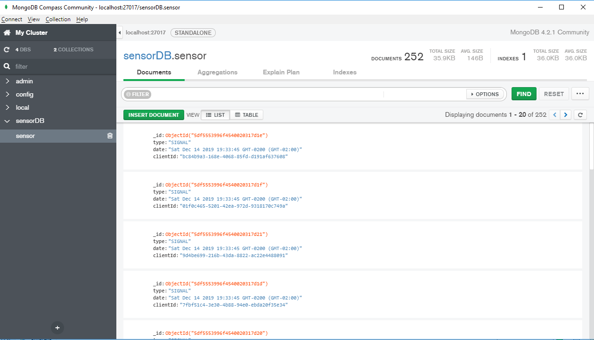
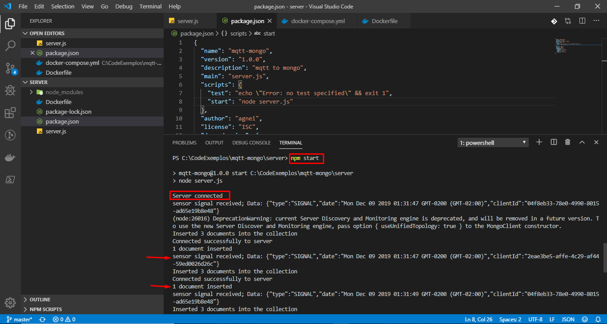
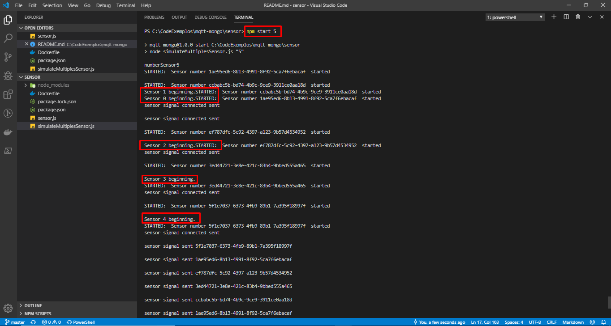

# MQTT Multiples sensor Example Application

A sample application built that shows how MQTT could be used to manage a multiples sensor sent data
to a server,  which will record it into da mongo data base


##RUN 

for localhost porpose use command line for start mqtt container and mongodb

docker run --name mongodb -p 27017:27017 -d mongo

docker run -it -d -p 1883:1883 -p 9001:9001  eclipse-mosquitto

docker ps -a

MAKE SURE both mongodb and mosquitto service broker container are running before run server and sensor 

## Starting SERVER

access server folder and run:

```
npm install 
```

```
node node.js
or 
npm start
```

## Starting Sensor

access sensor folder and run:

```
npm install
npm run 5
```

where "5" is the number of sensor you want to  simulate. You can use any positive number you want.
the more, the more will be if sensors initialized in your memory.


If you're using VS Code open each folder (server, sensor) in one new VSCode Windows and push F5. 






